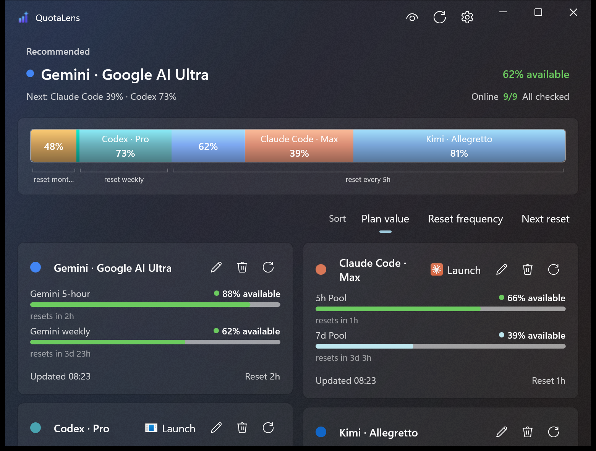

# QuotaLens

**One glance tells you which AI coding tool to use right now.**

A native Windows dashboard for quota, usage, and balances across **50 AI coding providers**. 
No QuotaLens backend, no account, and no telemetry.

**English** · [简体中文](README.zh-CN.md)

You open Claude Code, fire off a prompt, and *then* find out the weekly pool ran dry an hour ago. So you try Codex. Also dry. Three tools later you're finally working. QuotaLens watches every AI coding plan you pay for and answers the only question that matters when you sit down: **which one has headroom right now?**

|  |  |  |
| :-- | :-- | :-- |
| **Use this now** See which paid plan still has useful headroom. | **See all your runway** Compare remaining capacity without opening every tool. | **Know when it returns** Reset countdowns make it easy to plan around limits. |
| **One calm dashboard** Quota windows, balances, and accounts in one place. | **50 providers** Bring a mixed AI coding toolkit into one view. | **Quick setup** Add the tools you use and let QuotaLens keep watch. |
| **Privacy toggle** One click masks emails and balances for screen sharing. | **Sort your way** Surface the plans and resets that matter to you. | **Native Win11** A fast, focused desktop app in English and 简体中文. |

## Install

Download the latest **[release](https://github.com/SpookySandwich/QuotaLens/releases/latest)**:

| File | Notes |
| :-- | :-- |
| `QuotaLens-Setup-<version>-win-x64.exe` | Per-user installer, no admin needed. Start Menu + optional desktop shortcut. |
| `QuotaLens-portable-<version>-win-x64.zip` | Unzip, run `QuotaLens.exe`. |

Requires **Windows 11 x64**. The build is self-contained — no separate .NET or Windows App SDK runtime to install.

Then launch QuotaLens, add the providers you use, and check the top card whenever you need to choose a tool.

## Why QuotaLens

AI coding limits are scattered across apps, CLIs, websites, accounts, and reset windows. QuotaLens brings them together so you can stop guessing, avoid interrupted work, and get more value from the plans you already pay for.

The recommendation points you toward a useful plan now, the timeline shows your remaining runway, and provider cards show the limits and reset times behind that choice.

<b>All 50 providers</b>

 

| | | | |
| :-- | :-- | :-- | :-- |
| Abacus AI | Alibaba | Amp | Augment |
| AWS Bedrock | Azure OpenAI | BayesDL | Claude Code |
| Codebuff | Codex | codex-lb | Command Code |
| Crof | Cursor | DeepSeek | Deepgram |
| Doubao | ElevenLabs | Factory | Gemini |
| GitHub Copilot | Grok | Groq | JetBrains AI |
| Kilo | Kimi | Kiro | LLM Proxy |
| Manus | MiMo | MiniMax | Mistral |
| Moonshot | Ollama | OpenAI API | OpenCode |
| OpenCode Go | OpenRouter | Perplexity | Qoder |
| StepFun | Synthetic | T3 Chat | Venice |
| Vertex AI | Warp | Windsurf | z.ai |

## Privacy

QuotaLens runs locally, has no QuotaLens account or backend, and sends no telemetry. It contacts only the providers you configure.

## Documentation

- **[User guide](docs/user-guide.md)** — setup, provider connections, dashboard behavior, troubleshooting, and local data.
- **[Developer guide](docs/developer-guide.md)** — architecture, build, test, and packaging conventions.

## Acknowledgements

**[CodexBar](https://github.com/steipete/CodexBar)** by Peter Steinberger — the macOS menu-bar quota tracker whose provider implementations and meticulous per-provider notes are the source of much of QuotaLens's usage-API knowledge.

**[codex-lb](https://github.com/Soju06/codex-lb)** by Soju06 — the pooled-account load balancer that the codex-lb provider reads from.

Both MIT-licensed; see [THIRD-PARTY-NOTICES.md](THIRD-PARTY-NOTICES.md).

## License

[MIT](LICENSE)
